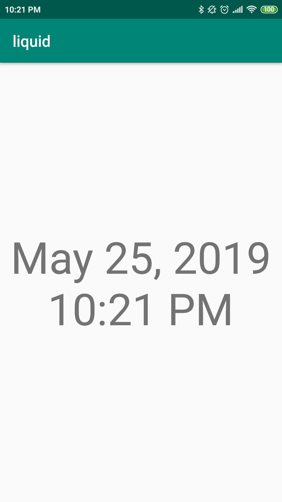

# LIQUID

A simple demo for a time service as peripheral with Bluetooth LE (Low Energy)

> Tested with Xiaomi Redmi Note 4

**Reference**

This initiated source is inspired by https://github.com/androidthings/sample-bluetooth-le-gattserver